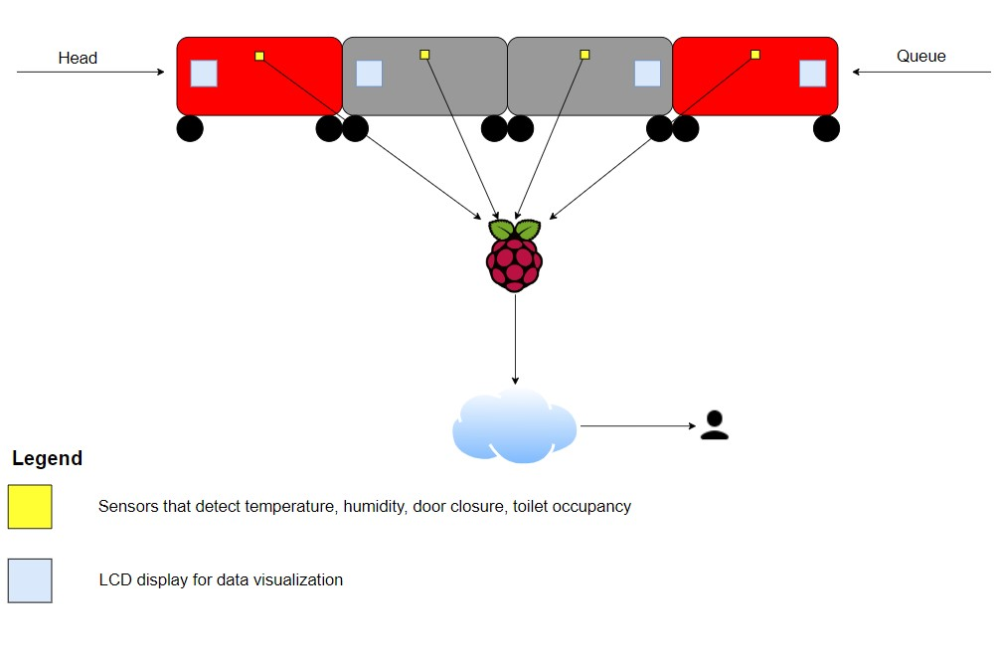
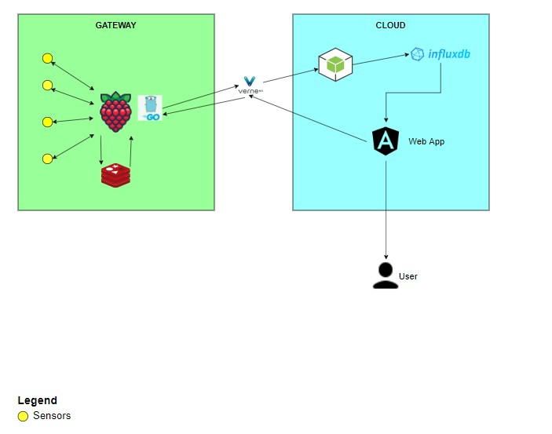

## Purpose of the project
Create a system to monitor the status of wagons and to control the operation both from internal train workstation and remotely.

## Context of the project
- The system connect every wagon to a microcontroller board that detect temperature, humidity, door closing status and toilette occupancy
- The system can lead the climatization indipendetely for each wagon, doors opening and emergency signalers
- Every wagon board must have a LCD display that can be able shows messages sent by a remote controller, reads the sensors and modify functioning parameters

## Project planning
### General architecture

As can be seen in the image, the sensors send data to the gateway (in this case Raspberry) which sends it to the cloud which displays it to the user.

### Specific architecture

As can be seen in the image, the sensors collect and send data to Raspberry; then Raspberry queues data in a non-permanent Redis queue and, in the event that there is no connection, it shows them on the GUI. If there is connection, Raspberry sends a file json to the node.js application that sends data in turn to InfluxDB.

### Initial brainstorming
In our initial brainstorming we have collected as much informations as possible to rearrange ideas. 
During this phase we created the architecture of the project, talked about which technologies use and how to divide the jobs (Look the chapter 'Group Members').

### Trello

We used a Trello Kanban to manage and visualize all tasks we need to do to complete the project. Each time a task was completed it was moved to the "done" column.

### Gantt Diagram
[](https://mermaid.live/edit#pako:eNqVk01r3DAQhv_KoPMavM4mC76VdRIKXcgXlIIvE2nWUSNLRpaSbkP-e8extU7C5lBdjDTPzLyvxnoR0ikSpWjQhlBb4BV0MARX3v0mGeCn849wOUSh0th4bEdKYaAL51sMAFWVbbfZL15jrOdE7SxUTsaWbMC_vKMx9q1ptPMWh3MH6gNRwvIky0-zIi-KBayWakrx8kEHCiF6hIYseTTMFvnMLotjbN-R1Dst8Sv4_7VceeoPDOy0fZOSr7J8PaFr9fESLrRvn9FTyncNq5vypWujZX3jrievR2fruXOxVscyle47g3v4salYKZs7S-Y-tb_kOT3j_nh3RXBDXKoEGIHv9km7YbYa0IA0LiqWs5zLr6byN1rSwQNapRM8hm-ftIld56B1KhoH_oDPJt9NpDjjsmNm-ib9m6Hs555vAhUag4MJTCZGbOMJDxjeYz_McjU3Sxf6zqvkRtvruzvoIx_vTPxT3ZezlrTEQrTEv7xW_GJehlgtwgO1VAtuLhT6x1rU9pW52A0P5Fzp4Lwod2h6WgiMwd3urRRl8JESND2riXr9Bw5RIM0)

We used a Gantt Diagram made with Mermaid js to organize and set deadlines of our tasks.
