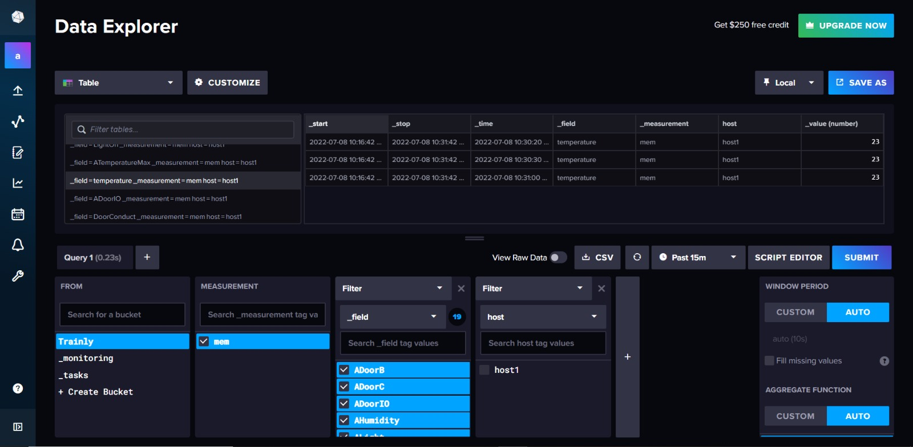

## Receiving data

Cloud receive data from raspberry py with MQTT protocol.
The cloud subscribes to the VerneMQ broker topic where the gateway publishes information; this way the data can be saved to the database and displayed.

This is the JSON that arrives on InfluxDB:

{
  "IdTrain": value,
  "IdWagon" : value,
  "AdoorIO" : value,
  "AdoorB" : value,
  "AdoorC" : value,
  "ATemperatureMax" : value,
  "ATemperatureMin": value,
  "ALight" : value,
  "AHumidity" : value,
  "Door1": value,
  "Door2": value,
  "Door3": value,
  "Door4": value,
  "DoorBath": value,
  "DoorConduct": value,
  "Humidity": value,
  "temperature": value,
  "LightMode": value,
  "LightOn": value
}

## Data management

The node.js application receives the data and sends it to InfluxDB to storage it in the database.

## Web app

We created a node.js web app that receives data from InfluxDB and shows them in a web interface; the aim of this web app is to send commands to the gateway that sends in turns to the microcontroller that modify the value of temperaturea and the status of the doors (open/close).

## Gallery
This is the InfluxDB data interface.

