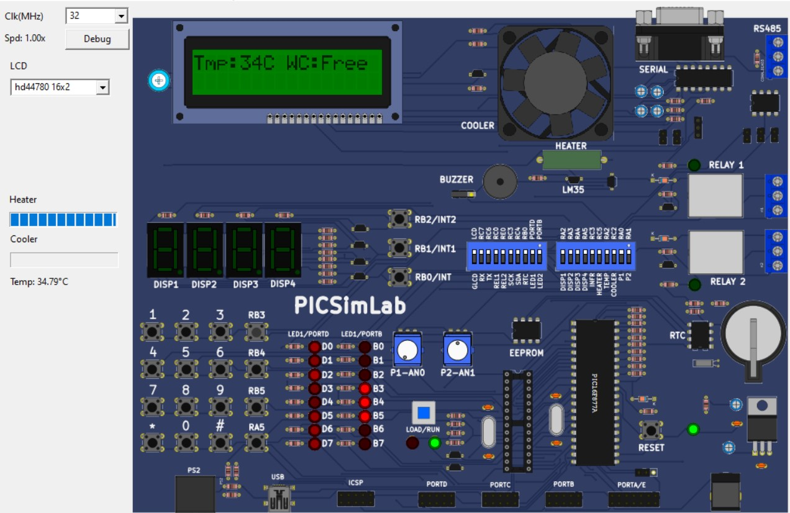
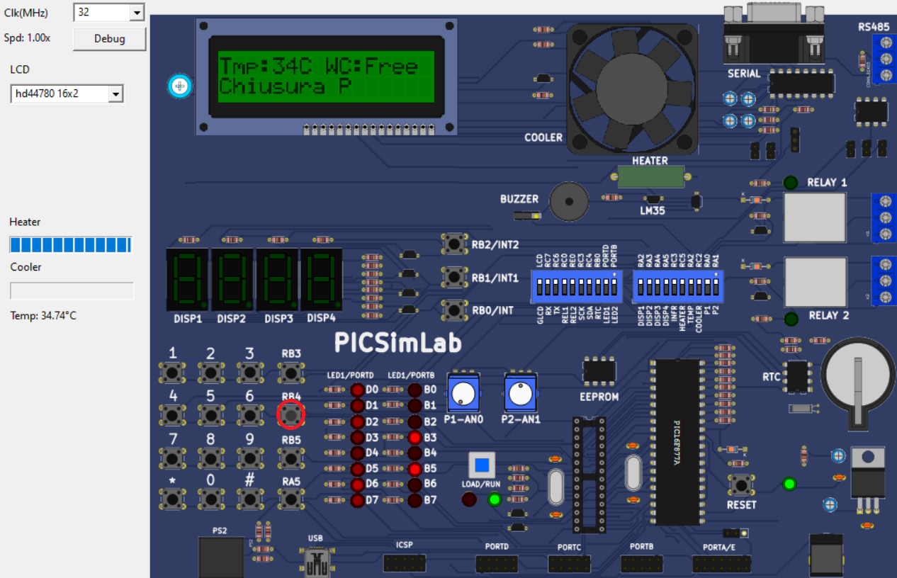
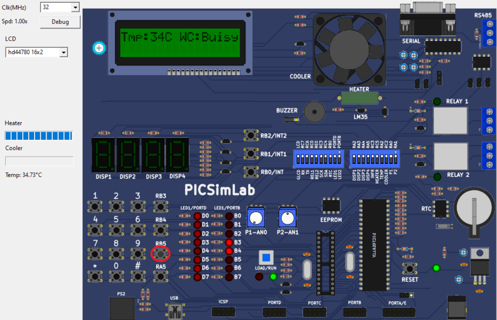
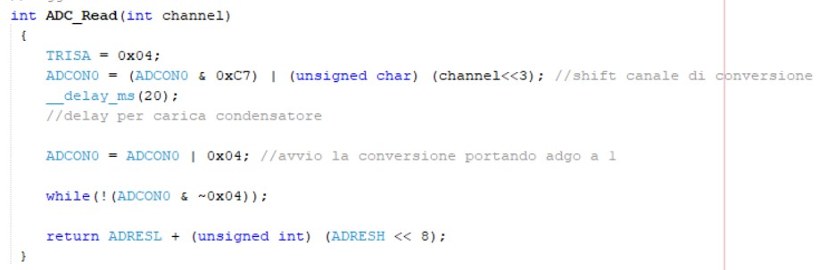
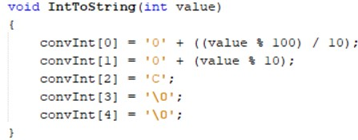
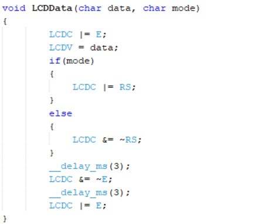
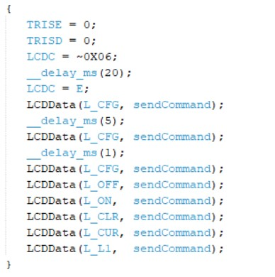

## Collect and sending data
The firmware part include data collection and sending data; data collects by the sensors are temperature, humidity, status of wagons and toilette occupancy. Datas are collect by BUS RS485 that sent them to the gateway. 

We use PicSimLab to simulate the electronic board that due to technical problems we could not get working.

## Gallery
The following picture shows the main screen of the LCD display.

RB3 button opens the doors.

RB4 button closes the doors.

RB5 button sets the bathroom as busy.

## Behind the scene
In this section we are going to give a brief explanation about the used code.

This function has the aim to read the data (like temperature) and return a value between 0 and 1024.

The first step is to set the analog-channel-corresponding-bit register.
By doing this, we are going to be able to read analog data throught the analog channel AN2.

ADCON0 register is used to manage the conversion process. First we select the channel, then wait 20ms for the 
capacitor to charge, set the GO bit to start reading the data, wait until it's resetted (conversion ended) and
return the data from the function.

This function converts int values to string values. Used to display data on LCD display.

Send data or command to LCD display.

Initialization of the LCD display.

