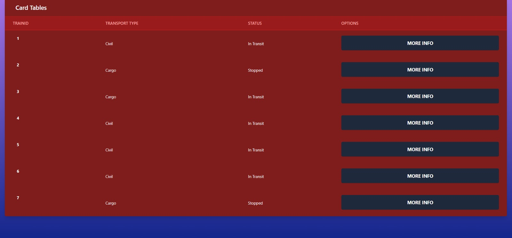
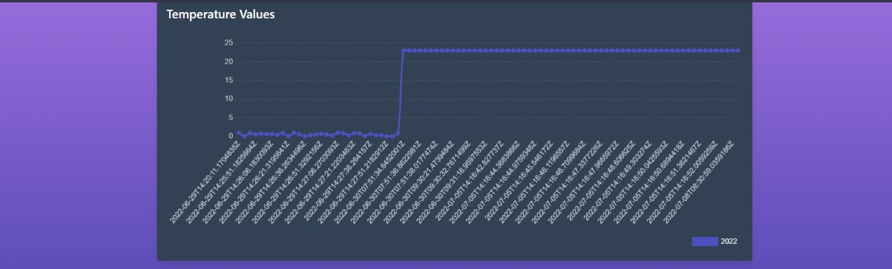
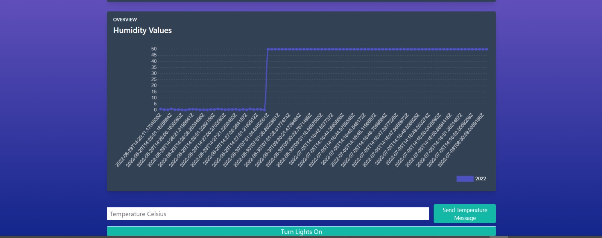

## Receiving data

The web app receives data from InfluxDB thanks to an API.

## Display data

Thanks to a GET API, the web app display data.

## Sending command

Thanks to a POST API, the web app send commands to the gateway.

## Gallery

